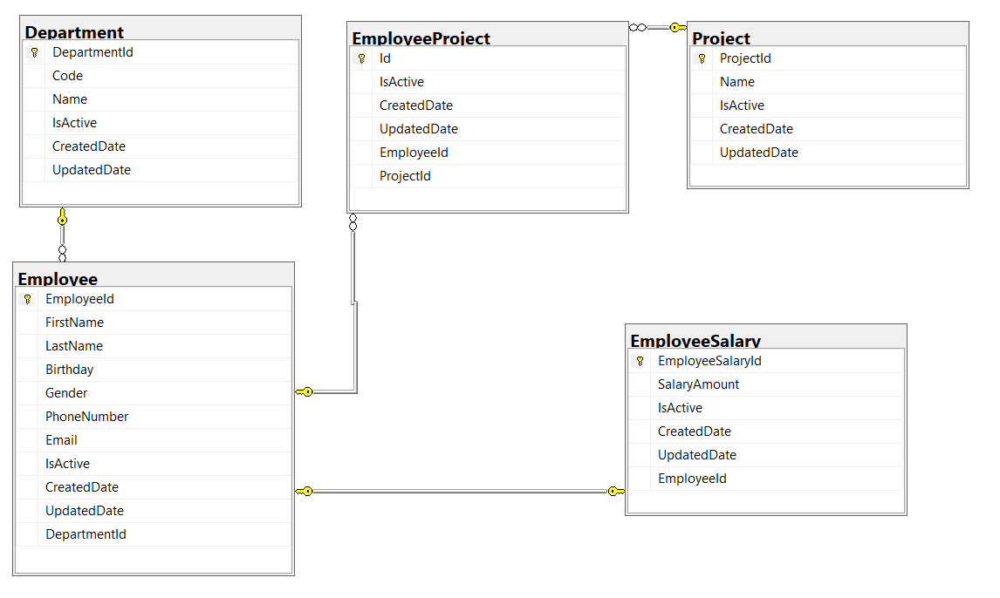
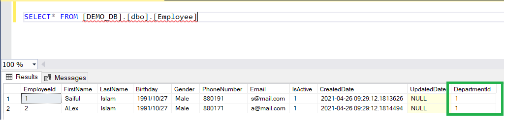
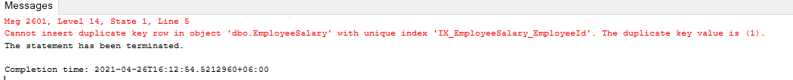
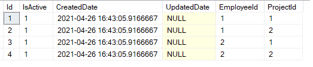

# Enitity Framekwork - Databse Design

## Technologies

-   [.NET 5](https://dotnet.microsoft.com/download)
-   [ASP.NET Core 5](https://docs.microsoft.com/en-us/aspnet/core)
-   [Entity Framework Core 5](https://docs.microsoft.com/en-us/ef/core)

## Practices

-   one-to-one, one-to-many, many-to-many relationship databse design
-   code first entity frmamework approach
-   Data seeding

## Run

Visual Studio

#### Prerequisites

-   [Visual Studio](https://visualstudio.microsoft.com/downloads/)
-   [.NET 5 SDK](https://dotnet.microsoft.com/download/dotnet/5.0)
-   [SQL Server](https://go.microsoft.com/fwlink/?linkid=866662)

#### Steps

1. Open **EntityFramework.Database.Design.sln** in Visual Studio.
2. Open nuget package console
3. Run commands migration commands  
   `Add-Migration InitialCreate`  
   `Update-Database`
4. Verify that database is created with seed dada
5. Run the project

Visual Studio Code

#### Prerequisites

-   [.NET 5 SDK](https://dotnet.microsoft.com/download/dotnet/5.0)
-   [SQL Server](https://go.microsoft.com/fwlink/?linkid=866662)
-   [Visual Studio Code](https://code.visualstudio.com)
-   [C# Extension](https://marketplace.visualstudio.com/items?itemName=ms-vscode.csharp)

#### Steps

1. Open directory **entity-framework-database-design** in vs code
2. Open Integrated Terminal under **EntityFramework.Database.Design** directiory
3. Run commands migration commands  
   `dotnet tool install --global dotnet-ef `  
   `dotnet ef migrations add InitialCreate `  
   `dotnet ef database update`
4. Verify that database is created with seed data

## Check Relationship

One to Many Relationship

#### Department and Employee

-   One Employee is associated only one department
-   One Department has many Employees
-   So we need to add reference in Employees (many) table

#### Verify that Same DepartmentId is used many items in Employee table

One to One Relationship

#### Employee and EmployeeSalary

-   One Employee is associated only one EmployeeSalary
-   One EmployeeSalary is associated only one Employees
-   So we need to add reference in both (EmployeeSalary and Employee) table but foreign key will be used only in mendotory table i.e EmployeeSalary

#### Execute the following inset query twice

      INSERT INTO [EmployeeSalary] (
      [EmployeeId]
      ,[SalaryAmount]
      ,[IsActive]
      ,[CreatedDate]
      )
      VALUES (1, 3000, 1, GETDATE());

#### Generally in One to many relation, you could enter multiple times EmployeeID, but here in one to one relation an error will be thrown while executing the query except first time

#### Verify that no duplicate EmployeeId is allowed EmployeeSalary table

Many to Relationship

#### Employee and Project and EmployeeProject

-   One Employee can be associated many projects
-   One Project can be can be associated many Employees
-   So we have created this new table i.e EmployeeProject
-   We also need to add reference of both (project and Employee) table in EmployeeProject table

#### Execute the following inset query twice

      INSERT INTO [EmployeeProject] (
            [EmployeeId]
            ,[ProjectId]
            ,[IsActive]
            ,[CreatedDate]
            )
            VALUES
         (1, 1, 1, GETDATE()),
         (1, 2, 1, GETDATE()),
         (2, 1, 1, GETDATE()),
         (2, 2, 1, GETDATE());

#### Verify that Same EmployeeId and ProjectId is used many items in EmployeeProject table

